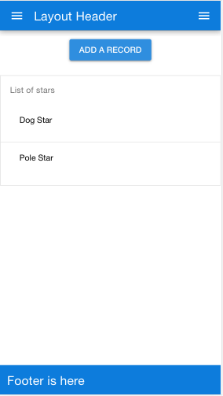

# quasar-template-meteor
Quasar Starter Kit for Meteor

(Updated 31st March 2018).

Quasar 0.15.10

Meteor 1.6.1

This is a resource which will show how to install Quasar inside the Meteor framework, with Vue2 also installed.
First of all, this was forked from **https://github.com/Akryum/meteor-vue2-example-routing**
and then we added Quasar to that. So thankyou to Akryum for making Meteor work with Vue. - Amazing work.


#### Please note these changes from 0.14.8
Quasar have split the es6 .js file into two:
- one for 'ios' 
- and one for 'mat' (material design - Android)

So I have changed the **transpile** command in package.json to transpile **both files.**

This also means that if you want to compile for 'ios' instead of 'mat' you will need to change your **import** from:
 '/node_modules/quasar-framework/dist/quasar.mat.common.js'
 to '/node_modules/quasar-framework/dist/quasar.ios.common.js'
 

#### Installation

**clone this repository:**

```
git clone https://github.com/quasarframework/quasar-template-meteor.git
```

**cd into the 'template' folder:**
```
cd quasar-template-meteor/template
```

**Install from npm**

```
meteor npm install
```
**Then here we transpile two es6 .js files (one for ios, one for material design) to commonjs which meteor needs**

We hope that in Meteor 1.6.2 we will be able to install without the transpile. 
Fingers crossed....

Do not remove .babelrc.RENAMED. It is necessary for the transpile script.

```
npm run transpile
```
**N.B. Windows users** - you should use transpile.bat instead of the above command - thanks to Antonin Adert.
If you want to see in detail what he did, please check out https://github.com/quasarframework/quasar-template-meteor/issues/18

**run meteor (still inside the template folder)**

```
meteor
```

———————

It should eventually say:
App running at: http://localhost:3000/

Point your desktop browser to that address.

Then if you open Chrome or Firefox dev tools and click on the mobile phone icon you should see this:


Please refer to guide.meteor.com/mobile.html for how to launch mobile apps on IOS and Android.

This project uses the Akryum projects to get Meteor working with vuejs and quasar-framework.
The most useful page to consult is:
https://github.com/meteor-vue/vue-meteor-tracker

This is the main page for all the Meteor/Vuejs projects:
https://github.com/meteor-vue/vue-meteor


#### Note:
The 'template' folder is necessary for the *quasar cli* command to function.
All meteor commands however should only be run once you are inside the 'template' folder.
This extra 'template' folder is there because quasar-framework requires it. Quasar-framework uses Webpack for its builds, but Meteor does not.
This means that it is unlikely that you will be able to use *quasar cli*, for example, because it all leads up to a quasar build using webpack.

To use Meteor, just cd into the 'template' folder and run all your usual meteor commands from there.

**Problems:**

1) I've had to create symlinks from /node_modules/quasar-extras to the /public folder for the Material Design icons.
There may be a better way of doing this.

2) Quasar es6 code in v0.15 has now been split into two: one for ios and one for material design.
I have not worked out how to switch automatically to the correct .js file according to the platform.


